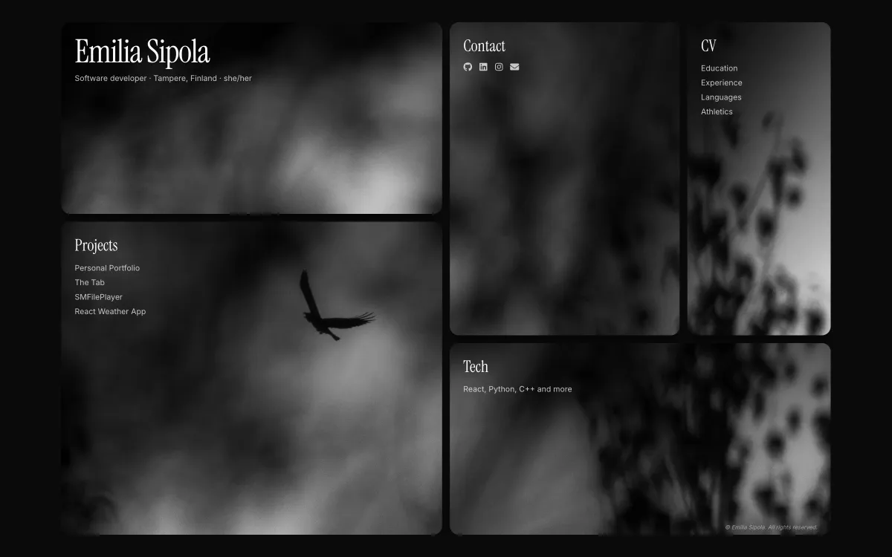

# Personal Portfolio for Emilia Sipola



🌐 **[emiliasipola.software](https://emiliasipola.software/)**

My personal portfolio website built with React, Vite, and Tailwind CSS.

## Features

- **Photo intro**: the page opens on one photo, which is then cut into the bento cards along golden-ratio lines
- **Cards open into sheets**: each card opens into a full sheet over the fixed photo, and its content fades in block by block
- **Flashlight**: a soft light follows the pointer across the photo, and the rest of the board dims slightly
- **Project shots in monochrome**: screenshots stay black and white until you hover them
- **Phones and reduced motion**: phones get a stacked layout, and the intro and animations are skipped when reduced motion is on

## Sections

| Section | Content |
|---|---|
| Overview | Bio, what I'm working on now, strengths, hobbies |
| Projects | Save Timelapse, purr, Personal Portfolio, The Tab, SMFileParser, React Weather App |
| Contact | GitHub, LinkedIn, Email |
| CV | Experience, education, languages, athletics, downloadable PDF |
| Tech | Frontend, backend, systems & games, Adobe, tools |

## Tech Stack

- [React](https://react.dev/)
- [Vite](https://vitejs.dev/)
- [Tailwind CSS](https://tailwindcss.com/)
- [react-icons](https://react-icons.github.io/react-icons/)

## Development

```bash
npm install
npm run dev
```

## Build

```bash
npm run build
```

## CV

The downloadable CV is built from `cv/cv.html`:

```bash
uv run --no-project --with weasyprint weasyprint cv/cv.html src/assets/Emilia_Sipola_CV.pdf
```
